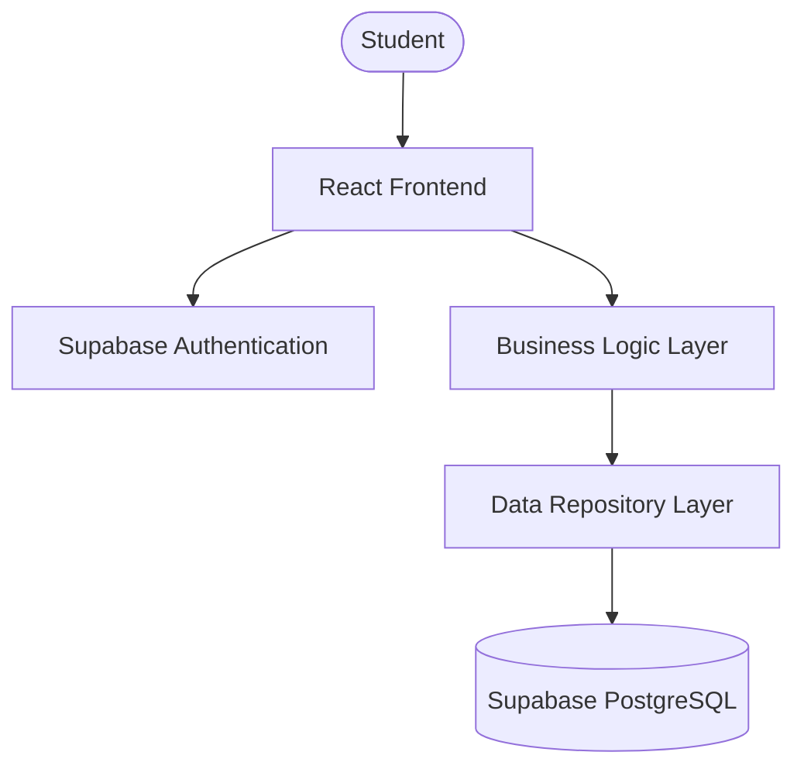
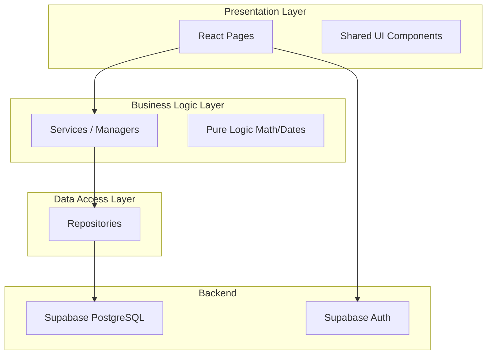
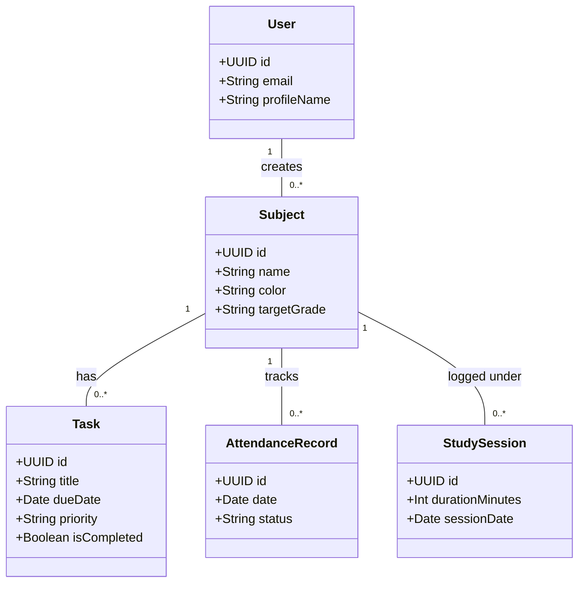
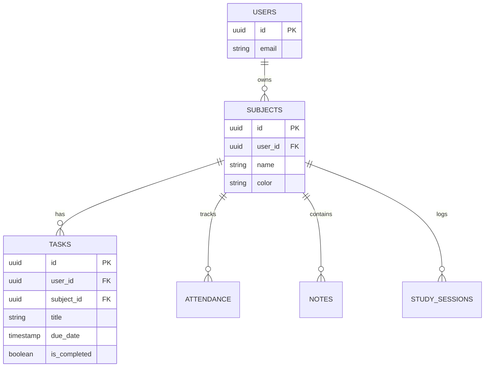
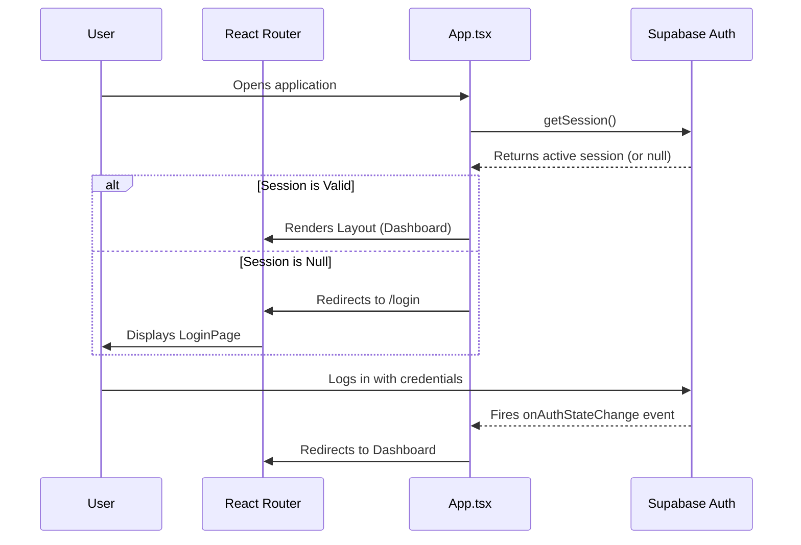

# StudyFlow: Student Academic Management System
## Software Design and Implementation Document

**Student Name:** Asif Hayat  
**Degree Program:** BS Software Engineering  
**Institution:** University of Engineering and Technology (UET)  
**Submission Date:** [Insert Date]  
**Version Number:** 1.0  
**Course Instructor:** [Insert Instructor Name]  
**Course Title:** [Insert Course Title]  
**Supervisor:** [Insert Supervisor Name]  

---

## 1. Introduction
### 1.1 Overview
StudyFlow is a comprehensive, modern Student Academic Management System designed to help university and college students manage their complex academic lives. Built as a responsive desktop-grade Progressive Web App (PWA), it consolidates tasks, schedules, study sessions, and academic progress tracking into a single centralized hub.

### 1.2 Problem Domain
Students often struggle to keep track of disjointed academic responsibilities scattered across syllabi, university portals, and personal calendars. Missed deadlines, poor attendance tracking, and inefficient study habits lead to academic stress and suboptimal performance.

### 1.3 Objectives
- Provide a unified dashboard for tracking tasks, attendance, and study hours.
- Offer actionable insights into academic progress.
- Facilitate active study techniques via integrated Pomodoro timers (Focus module) and AI-generated quizzes.
- Maintain strict data privacy through robust authentication and Row Level Security (RLS).

### 1.4 Scope and Intended Users
The system is scoped specifically for individual students. It does not include an administrative or teacher portal, focusing entirely on the end-user (the student) to self-manage their academic journey.

---

## 2. Problem Statement
Modern university education requires high organizational skills. Students face several persistent issues:
1. **Scattered Information:** Syllabi, timetables, and assignments are distributed across multiple platforms.
2. **Attendance Management:** Failure to maintain mandatory attendance thresholds leads to academic penalties.
3. **Inefficient Studying:** Students lack tools to enforce disciplined study sessions (e.g., Pomodoro technique) integrated directly with their task list.
4. **Progress Blindness:** It is difficult to visualize GPA trajectories and subject-wise performance over a semester.

StudyFlow directly addresses these issues by offering a cohesive suite of tools tailored to these exact pain points.

---

## 3. Proposed Solution
StudyFlow solves the problem of academic disorganization by providing a centralized, cloud-synced application. 

### Core Modules:
- **Dashboard:** A unified overview of today's classes, due tasks, and study metrics.
- **Subject & Task Management:** Relational tracking of assignments against specific enrolled courses.
- **Focus & Planner:** Integrated Pomodoro timers linked to daily academic tasks.
- **Analytics & Records:** Visual graphs tracking study times and grades.



---

## 4. Requirements Analysis

### 4.1 Functional Requirements

| Req ID | Description | Input | Expected Output | Status |
|---|---|---|---|---|
| FR-01 | **User Authentication** | Email & Password | Authenticated Session JWT | Implemented |
| FR-02 | **Password Recovery** | Email Address | Reset link sent, UI updates to accept new password | Implemented |
| FR-03 | **Subject Management** | Subject Name, Color, Target Grade | Subject saved and displayed in lists | Implemented |
| FR-04 | **Task Management** | Title, Due Date, Subject, Priority | Task created, triggers overdue logic based on date | Implemented |
| FR-05 | **Global Search** | Text Query | Dropdown showing matched Notes, Subjects, and Tasks | Implemented |
| FR-06 | **Focus Timer** | Task Selection, Duration | Countdown timer executes, saves session on completion | Implemented |
| FR-07 | **AI Helper (Quiz)** | Study Notes | AI generates JSON multiple-choice quiz | Implemented |
| FR-08 | **Attendance Tracking** | Subject, Date, Status (Present/Absent) | Updates attendance % dynamically | Implemented |

### 4.2 Non-Functional Requirements
- **Security:** The system must enforce Row Level Security (RLS) so users can only access their own data. (Implemented)
- **Usability:** The UI must support both Light and Dark themes dynamically without readability loss. (Implemented)
- **Performance:** Complex date calculations and state filtering must run efficiently without blocking the main thread. (Implemented)
- **Scalability:** The backend must be able to handle concurrent user sessions via Supabase edge infrastructure. (Implemented)

---

## 5. System Architecture
StudyFlow employs a strict **3-Tier Layered Architecture** adapted for modern frontend development. This separation of concerns ensures maintainability and scalability.

1. **Presentation Layer (`src/presentation/`):** React components, pages, and CSS. Handles UI rendering, theme state, and user interactions. *Does not contain direct database queries.*
2. **Business Logic Layer (`src/business/`):** Contains Services (e.g., `taskService.ts`, `authService.ts`) and Pure Logic (e.g., `taskLogic.ts`). Orchestrates data transformations, date math, and API payload formatting.
3. **Data Access Layer (`src/data/`):** Contains Repositories (e.g., `subjectRepository.ts`). This is the *only* layer permitted to interact with the Supabase client. 



---

## 6. Use-Case Diagram

```mermaid
usecaseDiagram
    actor Student
    
    package "StudyFlow System" {
        usecase "Authenticate (Login/Register)" as UC1
        usecase "Recover Password" as UC2
        usecase "Manage Subjects" as UC3
        usecase "Manage Tasks & Deadlines" as UC4
        usecase "Mark Attendance" as UC5
        usecase "Run Focus Session (Pomodoro)" as UC6
        usecase "Generate AI Quiz" as UC7
        usecase "View Analytics" as UC8
    }
    
    Student --> UC1
    Student --> UC2
    Student --> UC3
    Student --> UC4
    Student --> UC5
    Student --> UC6
    Student --> UC7
    Student --> UC8
```

### Use-Case Description Table
| ID | Name | Actor | Preconditions | Main Flow | Postconditions |
|---|---|---|---|---|---|
| UC4 | Manage Tasks | Student | User is logged in | User navigates to Tasks, clicks 'Add', fills form, saves. | Task is stored in Supabase; Dashboard updates. |
| UC6 | Run Focus Session | Student | User is logged in | User navigates to Focus, sets timer, clicks Play. | Timer runs; on finish, a StudySession record is saved. |

---

## 7. Class Diagram (Conceptual Domain Model)
As this is a functional React/TypeScript application, traditional OOP classes are replaced with TypeScript Interfaces that represent the domain entities.



---

## 8. Database Design and ER Diagram
The system utilizes a relational PostgreSQL database hosted on Supabase.



### Database Security (RLS)
Every table implements strict Row Level Security (RLS) policies ensuring that `user_id = auth.uid()`. This guarantees isolation in a multi-tenant cloud environment.

---

## 9. Module Design

### 9.1 Dashboard Module
- **Purpose:** Acts as the central hub.
- **Functionality:** Calculates `completionPercentage` for today's tasks, displays upcoming classes for the current day of the week, and houses the Global Search bar.
- **Status:** Fully Implemented.

### 9.2 Task Management Module
- **Purpose:** Tracks academic deliverables.
- **Functionality:** Supports creating tasks categorized by `Subject`. Utilizes `taskLogic.ts` to dynamically calculate `isTaskDueToday` and `isTaskOverdue` based on real-time date evaluation.
- **Status:** Fully Implemented.

### 9.3 Focus & Planner Module
- **Purpose:** Promotes deep work.
- **Functionality:** A React-based countdown timer that prevents the user from leaving the page. Upon successful completion, it writes a record to the `study_sessions` table.
- **Status:** Fully Implemented.

### 9.4 AI Helper Module
- **Purpose:** Enhances learning via active recall.
- **Functionality:** Sends user notes to the Google Gemini API to generate structured JSON quizzes, which are then parsed and rendered as interactive forms.
- **Status:** Fully Implemented.

---

## 10. Workflow and Sequence Diagrams

### Sequence Diagram: Authentication & Global Route Protection



---

## 11. User Interface and User Experience
- **Theme System:** Implements a dynamic CSS Variables system (`var(--bg)`, `var(--text)`) toggled via a `data-theme` HTML attribute. This provides high-contrast Light and Dark modes.
- **Responsiveness:** Fluid grid layouts ensure usability across desktop resolutions.
- **Feedback:** "Toaster" notifications or localized error banners (e.g., during login failure) ensure the user is always aware of system state.

*(Placeholder: Insert Screenshot of Dashboard Here)*
*(Placeholder: Insert Screenshot of Task Manager Here)*

---

## 12. Technology Stack

| Component | Technology | Rationale |
|---|---|---|
| Frontend Framework | React 18 | Component-based architecture allows modular UI building. |
| Language | TypeScript | Static typing prevents runtime errors and defines strict data shapes. |
| Build Tool | Vite | Extremely fast Hot Module Replacement (HMR) for development. |
| Backend & DB | Supabase (PostgreSQL) | Provides instant APIs, Auth, and a highly scalable relational DB. |
| Styling | Vanilla CSS | Ensures zero dependencies and maximum performance utilizing CSS Variables. |
| Icons | Lucide React | Lightweight, consistent SVG icon library. |
| AI Integration | Google Gemini API | Capable of complex JSON structural generation for quizzes. |

---

## 13. Security Design
1. **Authentication:** Handled entirely by Supabase Auth (JWT-based).
2. **Row Level Security (RLS):** Database policies verify `auth.uid()` for every `SELECT`, `INSERT`, `UPDATE`, and `DELETE` operation. A malicious user cannot query another student's data even with direct API access.
3. **Password Recovery:** Implemented via secure hashed tokens sent to verified email addresses, parsed dynamically by the React frontend (`#type=recovery`).
4. **Environment Variables:** Sensitive keys (Supabase URL, Anon Key, Gemini Key) are stored in `.env.local` and never pushed to version control.

---

## 14. Testing and Validation
*Note: As an academic project, rigorous automated testing (Jest/Cypress) is proposed for future iterations. Current validation relies on extensive manual UI and integration testing.*

| Test ID | Scenario | Expected Result | Actual Result | Status |
|---|---|---|---|---|
| TC-01 | Register new user | Account created, redirected to Dashboard | Account created, redirected | Passed |
| TC-02 | Create overdue task | Task appears with red overdue indicator | Appears correctly | Passed |
| TC-03 | Toggle Dark Mode | Colors swap to dark palette instantly | Colors swap flawlessly | Passed |
| TC-04 | Global Search | Typing "Bio" finds Biology subject/notes | Results populate dropdown | Passed |
| TC-05 | Password Reset | Clicking email link opens "Set New Password" | Hash detected, UI swaps | Passed |

---

## 15. Implementation Challenges and Solutions
1. **Challenge:** Routing after Password Reset. Supabase appends a hash fragment (`#access_token=...`) to the URL, which React Router occasionally mishandled or ignored if redirected prematurely.
   **Solution:** Implemented a global `onAuthStateChange` listener in `App.tsx` that intercepts the `PASSWORD_RECOVERY` event and cleanly routes the user to the update form.
2. **Challenge:** Dark Mode Visibility. Initially, dark mode was implemented using a CSS filter (`filter: invert(1)`), which corrupted image colors and lowered contrast.
   **Solution:** Refactored the entire application to use native CSS variables and a `data-theme` attribute for granular, perfect color control.

---

## 16. Limitations and Future Enhancements
### Limitations:
- **Offline Support:** The app currently relies heavily on Supabase; if the internet disconnects, features degrade.
- **Push Notifications:** Reminders are currently passive (UI only).

### Future Enhancements:
- **Service Workers:** Convert the app into a full Offline-First PWA using IndexedDB for local caching.
- **Web Push API:** Implement browser-level notifications for upcoming exams.
- **Collaborative Study:** Allow students to share Notes and Quizzes with peers.

---

## 17. Conclusion
StudyFlow successfully achieves its goal of providing a robust, centralized academic management platform for students. By leveraging modern web technologies (React, TypeScript, Supabase) and adhering to a strict 3-Tier Layered Architecture, the codebase is highly maintainable, secure, and scalable. The integration of advanced features like AI quizzes and Pomodoro timers positions StudyFlow as a highly effective tool for academic success.

---

## 18. References
1. Supabase Documentation. (2026). *Authentication & Row Level Security*. Retrieved from https://supabase.com/docs
2. React Server Components & Hooks. (2026). *React Official Documentation*. Retrieved from https://react.dev
3. Google Gemini API. (2026). *Prompting for JSON output*. Retrieved from https://ai.google.dev
4. Robert C. Martin. (2017). *Clean Architecture: A Craftsman's Guide to Software Structure and Design*. Prentice Hall.
